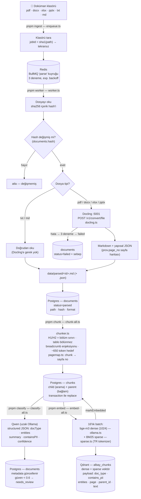
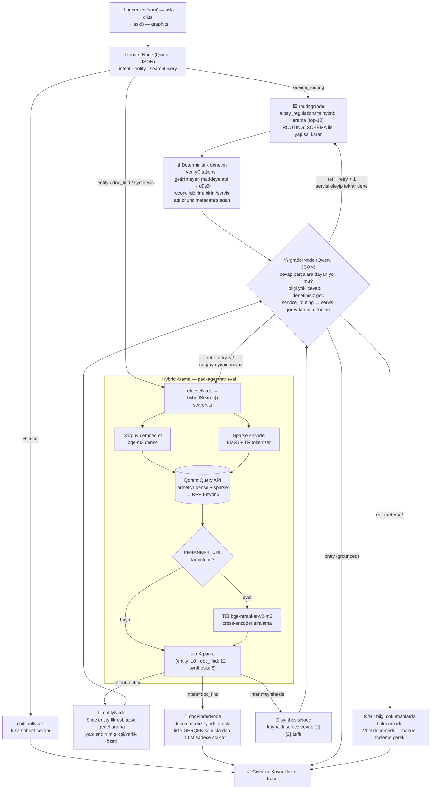

# Vergi Dairesi Evrak ve Yazışma Sistemi

Vergi dairesine gelen dilekçe ve yazışmaları otomatik okuyup sınıflandıran, **Vergi
Daireleri Kuruluş ve Görev Yönetmeliği**'ne dayanarak ilgili servise yönlendiren ve
resmî formatta cevap yazısı taslağı üreten, tamamen **on-premise (air-gapped)** bir
multi-agent RAG sistemi.

TypeScript + LangGraph.js orkestrasyon, Qdrant hybrid arama (dense + BM25), yerel
Ollama (qwen2.5:14b-instruct + bge-m3), Fastify API ve React arayüz. Her cevap kaynak
atıflıdır; dayanak yoksa sistem **"bulunamadı"**, yönlendirmede net dayanak yoksa
**"belirlenemedi — manuel inceleme gerekli"** der. Hiçbir servis adı, vergi numarası
ya da tutar uydurulmaz.

## Hızlı Kurulum

### Ön gereksinimler

- **Node.js 24+** — `nvm install 24`
- **pnpm** — `corepack enable && corepack prepare pnpm@latest --activate`
- **Docker + Docker Compose** — Colima ya da Docker Desktop
- **Ollama sunucusu** — `qwen2.5:14b-instruct` ve `bge-m3` modelleri yüklü
  (uzak makinede olabilir; adresi `.env` içinde)

### 1. Repo ve bağımlılıklar

```bash
git clone <repo-url> && cd albay-vdi-rag
pnpm install
cp .env.example .env          # OLLAMA_BASE_URL ve LETTER_* alanlarını doldurun
```

`LETTER_*` alanları resmî yazının antet/imza bilgileridir. Boş bırakılırsa yazıda
görünür yer tutucu (`[DETSİS NO]`) basılır ve arayüzde eksik olarak raporlanır —
hiçbiri uydurulmaz.

### 2. Altyapı servisleri

```bash
docker compose up -d          # Qdrant, Redis, Postgres, Docling
pnpm migrate                  # DB şeması (idempotent)
```

### 3. Cevap yazısı PDF'i için Chromium (bir kez, ~150 MB)

```bash
pnpm --filter @albay/letter exec playwright install chromium
```

### 4. Yönetmelik indeksleme (ilk kurulumda bir kez)

Servis yönlendirmesinin **tek dayanağı** budur; bu adım atlanırsa hiçbir evrak
yönlendirilemez.

```bash
pnpm worker &                                          # parse worker'ı açık olmalı
pnpm ingest corpus/regulations --corpus regulations
pnpm pipeline -- --corpus regulations
```

### 5. Sağlık kontrolü

```bash
pnpm smoke                    # Qdrant · Redis · Postgres · Docling · Ollama · API · Chromium
```

### 6. Uygulamayı başlat

```bash
pnpm dev                      # API + worker + web arayüzü birlikte
```

Tarayıcıda: **http://localhost:5173**

Ayrı terminaller tercih ediliyorsa: `pnpm api`, `pnpm worker`, `pnpm run web`.

## Kullanım

### Evrak ekleme ve işleme

Gerçek işleyişte vergi dairesine gelen her belge önce **Yazışma ve Arşiv Servisi**'ne
girer, kaydı yapılır, sonra ilgili servise sevk edilir (Yönetmelik M.11-B-I-6).
Arayüz bu akışı birebir izler:

1. **Evrak Ekle** sekmesinden bilgisayarınızdan **birden fazla** dosya seçin
   (sürükle-bırak da olur). Toplu klasör ingest'i için: `pnpm ingest <klasör>`
2. Belge Yazışma ve Arşiv kaydına girer ve **Cevap Yazısı Yazılmayan Dilekçeler**
   listesine düşer. Arka planda hat çalışır:
   **parse → chunk → analiz → servis yönlendirme → embed**
3. Belgeyi açıp sohbet edin, kararı verip cevap yazısını üretin
4. PDF indirildiği anda evrak **Cevap Yazısı Yazılan** tarafına geçer

### Yazışma ve Arşiv paneli

Yönetmelikte evrakın giriş noktası olan servis (M.11-B-I-6) burada yazılıma taşınmıştır:
kuruma giren her belge, servise yönlendirilmiş olsun ya da olmasın, cevap yazısı
üretilene kadar **"Cevap Yazısı Yazılmayan"** listesinde kalır. PDF dışa alındığı anda
**"Cevap Yazısı Yazılan"** tarafına geçer.

| Durum | Anlamı |
|---|---|
| Yeni | Yüklendi, henüz sınıflandırılmadı |
| Yönlendirildi | Servise sevk edildi, henüz üzerinde çalışılmadı |
| Serviste işleniyor | Çalışan belgeyi açtı |
| Cevap yazıldı | PDF dışa alındı, iş tamamlandı |

### Belge sohbeti

Yönlendirilen belgeyi açın ve sorun — cevaplar yalnızca o belgenin içeriğine dayanır.
**Ataç** düğmesiyle ek mevzuat yükleyerek bağlamı genişletebilirsiniz; bu belgeler
yalnızca o sohbette kaynak olur, servis havuzuna girmez.

### Cevap yazısı

“Cevap Yazısı” sekmesinde kararı (onay / kısmi onay / red / eksik belge /
bilgilendirme) ve gerekçesini girin, taslağı üretin. Önizlemede konu, ilgi ve gövde
bloklarını doğrudan düzenleyebilirsiniz; PDF veya DOCX olarak indirin.

## Geliştirme

```bash
pnpm typecheck                # kök + apps/web
pnpm test                     # birim testleri
pnpm run web:e2e              # tarayıcı testi (API + web + Ollama ayakta olmalı)
pnpm eval -- --target agent   # golden set değerlendirmesi
pnpm smoke                    # altyapı sağlık kontrolü
pnpm routing:audit            # aynı tür evrak aynı servise mi gidiyor?
pnpm qdrant:sync -- --fix     # Qdrant ↔ Postgres indeks kaymasını temizle
pnpm mektup <ad-parçası> onay # arayüzsüz cevap yazısı üretimi (--ornek: LLM'siz)
```

## Sorun Giderme

**Arama hiçbir şey bulmuyor / belgeler boş görünüyor.** Postgres'teki `chunks`
tablosu ile Qdrant birbirinden kaymış olabilir (tablo elle düşürülmüş, doküman
silinmiş, chunk'lar yeniden üretilmiş). Kurtarma:

```bash
pnpm migrate                              # eksik tabloları geri getirir (idempotent)
pnpm qdrant:sync -- --fix                 # Postgres'te karşılığı olmayan vektörleri sil
pnpm worker &                             # hat çalışsın
pnpm pipeline -- --corpus regulations     # yönetmeliği yeniden indeksle (yönlendirmenin dayanağı)
pnpm pipeline -- --force                  # tüm evrakı yeniden chunk/analiz/yönlendir/embed
pnpm qdrant:sync                          # öksüz point: 0 olmalı
pnpm routing:audit                        # tutarsızlık: yok olmalı
```

Yeniden işleme **güvenlidir**: analiz sıcaklığı 0 olduğu için aynı belge aynı
kararı üretir, yaşam döngüsü durumu yalnızca ileri gittiği için "cevap yazıldı"
bilgisi kaybolmaz ve sohbet ekleri `session_id` sayesinde yine yönlendirilmez.

**`fetch failed` hatası.** Ollama'ya erişilemiyor demektir; `.env` içindeki
`OLLAMA_BASE_URL` adresini ve VPN bağlantınızı kontrol edin:

```bash
curl -m 5 "$(grep OLLAMA_BASE_URL .env | cut -d= -f2-)api/tags"
```

**Port 3001 kullanımda.** Önceki bir API süreci hayatta kalmış olabilir:

```bash
pkill -f "apps/api/src/server.ts"
```

## Repo Yapısı

```
packages/
├── shared/      # zod-dogrulamali config, ortak tipler
├── llm/         # Ollama client, evrak analizi, TCKN/VKN checksum
├── chunking/    # yapisal chunker + yonetmelik madde chunker'i
├── retrieval/   # Qdrant hybrid arama (RRF), BM25 sparse (TR), rerank
├── ingestion/   # Docling client, Postgres semasi/sorgulari
├── agents/      # LangGraph graph, servis yonlendirme, cevap yazisi taslagi
├── letter/      # resmi yazi: HTML sablonu (A4), Playwright PDF, DOCX
└── eval/        # golden set, smoke test, eval harness
apps/
├── api/               # Fastify: REST + SSE chat
├── web/               # Vite + React + Tailwind SPA
└── ingestion-worker/  # BullMQ worker'lari + tum CLI'lar
corpus/regulations/    # Vergi Daireleri Kurulus ve Gorev Yonetmeligi
docs/                  # parse/chunking rehberi, yonetmelik korpusu notlari
```

## Stack

| Katman | Teknoloji |
|---|---|
| Dil / runtime | TypeScript, Node.js, pnpm workspaces |
| Agent orkestrasyon | LangGraph.js |
| LLM + embedding | Ollama (uzak): qwen2.5:14b-instruct + bge-m3 |
| Vector DB | Qdrant — hybrid: dense (cosine) + sparse (BM25, IDF server-side) |
| Reranker (opsiyonel) | TEI + bge-reranker-v2-m3 (x86; `--profile rerank`) |
| Parse | Docling (Docker sidecar) — layout-aware Markdown + sayfa haritası |
| Kuyruk | BullMQ + Redis |
| Metadata | PostgreSQL |

## Kalite Durumu

Ölçüm: `pnpm eval -- --target agent` — kurum korpusu 16 doküman / 162 child chunk,
yönetmelik korpusu 1 doküman / 60 child chunk.

| Metrik | Hedef (PRD) | Ölçülen |
|---|---|---|
| Doğru kaynak oranı | ≥ %90 | %66,7 ⚠️ |
| Tuzak başarısı (uydurmama) | ≥ %98 | **%100** |
| Servis yönlendirme — beklenen cevap | — | **%100** (4/4) |
| Servis yönlendirme — yasak ifade | — | **%100** (yanlış servis önerilmedi) |
| Yönlendirme süresi | ≤ 4 sn | ~4–12 sn |

⚠️ Kaynak oranındaki düşüş bir regresyon değil: `ent-002`, `doc-001` ve `syn-001`
golden soruları `Albay_Intelligence_Hub_Process_Document.pdf` dokümanını bekliyor,
bu doküman güncel korpusta **indeksli değil**. Ya doküman yeniden ingest edilmeli
ya da golden-set güncel korpusa göre revize edilmeli.

### Servis yönlendirme golden senaryoları

| # | Senaryo | Beklenen | Sonuç |
|---|---|---|---|
| route-001 | Tecil / taksitlendirme dilekçesi | Vergilendirme > Sürekli Yükümlülükler Verg. Servisi, masa iddiası yok | ✅ M.11-A-I-2-f |
| route-002 | Uzlaşma talebi | Uzlaşma Servisi (Diğer Hizmet Birimi) | ✅ M.11-B-I-4 |
| route-003 | **Adversarial** — bilanço/gelir tablosu ekli beyanname | Vergilendirme > Sürekli Yükümlülükler, **Gelir Servisi DEĞİL** | ✅ M.10 + M.11-A-I-2 |
| route-004 | Yönetmelikte karşılığı olmayan talep | `belirlenemedi`, servis uydurulmamalı | ✅ |

## Yol Haritası

- [x] Faz 0-4 — Altyapı, parse hattı, chunking, sınıflandırma, hybrid retrieval
- [x] Faz 5 — LangGraph.js multi-agent orkestrasyon
- [x] Faz 5a — Vergi Dairesi servis yönlendirme (madde tabanlı chunking + routingNode)
- [x] Faz 5b — Evrak analizi, ingest-time yönlendirme, servis havuzları, SSE chat API
- [x] Faz 5c — Cevap yazısı üretimi (resmî format + PDF/DOCX)
- [x] Faz 5d — Web arayüzü (Vite + React) + GİB kurumsal kimliği
- [x] Faz 5e — Yazışma ve Arşiv paneli (belge yaşam döngüsü takibi)
- [ ] Faz 6 — Auth/ACL/audit, RAGFlow karşılaştırması ve cutover

## Notlar

- `data/parsed/` korpusun düz metin kopyasını içerir — **yedekleme/senkron araçlarının dışında tutun** (KVKK).
- PII içeren dokümanlar aramada varsayılan olarak filtrelenir (`contains_pii` bayrağı); yetki katmanı Faz 6'da.
- Apple Silicon'da reranker çalışmaz (TEI arm64 imajı yok) — kod reranker'sız otomatik çalışır, production x86 kurulumunda etkinleştirilir.
- **Air-gapped kurulum:** PDF üretimi Chromium'a bağlıdır (~150 MB). İnternetsiz
  ortamda `playwright install` çalışmayacağı için tarayıcı imaja gömülmeli
  (`mcr.microsoft.com/playwright` tabanlı bir imaj ya da `PLAYWRIGHT_BROWSERS_PATH`
  ile önceden indirilmiş klasör). Chromium yoksa API `503` ve kurulum komutunu
  içeren bir hata döner; DOCX üretimi etkilenmez.

---

# Detaylı Mimari

Bu bölümden sonrası sistemin iç işleyişi ve alınan tasarım kararlarıdır;
günlük kullanım için gerekmez.

## Akış Diyagramları

### 1. Veri Akışı — dosyadan Qdrant + Postgres'e (indeksleme hattı)



### 2. Sorgu Akışı — kullanıcı sorusundan cevaba (LangGraph.js graph'ı)



## Evrak İşleme Hattı ve API (Faz 5b)

Dışarıdan gelen evrak `pnpm ingest` (klasör) ya da arayüzdeki **Evrak Ekle**
sekmesi (`POST /api/upload`) ile sisteme girer;
worker zinciri **parse → chunk → analiz → servis yönlendirme → embed** adımlarını
yürütür ve belge ilgili servisin havuzuna düşer. HTTP isteği LLM'i beklemez.

**Belge analizi** (`packages/llm/src/analyzer.ts`) konu, uzun özet, evrak türü ve
yapısal entity'leri (VKN, TCKN, tarih, tutar, plaka, dönem) çıkarır. Kimlik
numaraları LLM'den geldiği gibi kabul edilmez: `identifiers.ts` içindeki TCKN/VKN
checksum'ından geçer, geçmezse ham metinden çapraz kontrol edilir, o da yoksa
`null` yazılır — resmî yazıya uydurma vergi numarası giremez.

### API uçları

| Uç | Açıklama |
|---|---|
| `GET /api/services` | Servis kataloğu + havuz doluluğu (yönetmelikten türetilir) |
| `GET /api/documents?service=` | Servis havuzu (`service=belirlenemedi` → manuel inceleme) |
| `GET /api/documents/:id` | Özet kartı + yönlendirme gerekçesi + madde referansları |
| `GET /api/documents/:id/file` · `/text` | Orijinal PDF · parse edilmiş metin |
| `POST /api/documents/:id/reroute` | Yeniden hesapla, ya da `{servis}` ile elle ata |
| `POST /api/upload` | Resmî evrak ekle (çoklu) → Yazışma-Arşiv kaydı + hat tetiklenir |
| `POST /api/chat` | **SSE** — belge kapsamlı, çok turlu |
| `GET /api/documents/:id/chat` | Sohbet geçmişi |
| `POST /api/session-upload?sessionId=` | Sohbete referans belge ekle (yönlendirilmez) |
| `POST /api/response-letter` | Cevap yazısı taslağı (`kaydet:true` → sayı al + kaydet) |
| `POST /api/response-letter/pdf` · `/docx` | Düzenlenmiş HTML'den PDF · modelden DOCX |
| `GET /api/documents/:id/letters` | Belge için üretilmiş yazılar |
| `GET /api/archive?durum=` | Yazışma ve Arşiv listesi (`pending` \| `completed`) |
| `POST /api/documents/:id/open` | “Çalışan belgeyi açtı” işareti |
| `GET /api/documents/status?paths=` | Yüklenen dosyaların hat ilerlemesi |

SSE olayları: `trace · token · sources · done · error`. Token akışı **belge
kapsamlı** sohbette gerçek zamanlıdır; `documentId` verilmezse korpus geneli
multi-agent graph çalışır ve ara adımlar `trace`, cevap tek parça yayınlanır.

Soru ve cevap tek işlemde yazılır (`appendChatExchange`) — akış yarıda kesilirse
hiçbiri yazılmaz, böylece geçmişte cevapsız kullanıcı mesajı birikmez.

**PII:** Vergi evrakının tamamı PII içerir. Belge kapsamlı sohbet ve yönlendirme
`includePII: true` ile çalışır; erişim kontrolü doküman değil kullanıcı
seviyesinde, Faz 6 ACL katmanında çözülecek.

**İndeks bütünlüğü:** Chunk id'leri her yeniden chunk'lamada yeniden üretildiği ve
doküman silindiğinde vektörleri Qdrant'ta kaldığı için indeks Postgres'ten
kayabiliyordu. Yazma yolu artık chunk öncesi `deleteByDocId` çağırıyor;
birikmiş kaymayı `pnpm qdrant:sync -- --fix` temizler.

## Vergi Dairesi Servis Yönlendirme

Gelen yazışma/dilekçe, **Yazışma ve Arşiv Servisi**'nin (M.11-B-I-6) yönetmelikteki
"evrakın ilgili yerlere sevkini sağlamak" görevinin yazılıma taşınmış hâlidir.
Karar hiçbir yerde hardcode edilmez; `corpus/regulations/` altındaki yönetmelik
metninden retrieval ile gelen maddelere dayanır.

**Güvence katmanları** (her biri LLM'den bağımsız):

1. `verifyCitations` — kararın atıf verdiği madde numaraları, o sorguda gerçekten
   getirilen parçalarda yoksa atıf düşürülür; geriye doğrulanmış atıf kalmazsa karar
   `belirlenemedi`ye indirilir. Uydurma madde numarasıyla servis ataması imkânsızdır.
2. `reconcileBirim` — ana/diğer hizmet birimi ataması modelin tahmininden değil,
   atıf verilen chunk'ın yönetmelik hiyerarşisi metadata'sından türetilir; servis adı
   da yönetmelikteki kanonik yazımla değiştirilir.
3. `routingGrader` — denetim, **yalnızca seçilen servisin görev tanımı** gösterilerek
   yapılır. Tüm parçalar birden verildiğinde model kendi kararını onaylamaya meyilli;
   daraltılmış bağlam "gelir tablosu → Gelir Servisi" tipi yüzeysel eşleşmeyi yakalar.
   Reddedilen servis ikinci denemede elenerek tekrar aranır.

### Tutarlılık: aynı tür evrak → aynı servis

Kurum işleyişinde aynı tür evrak aynı servise gitmelidir. Bu, ölçülen ve
sürdürülen bir özellik:

- **Kanonik yönlendirme girdisi.** Yönlendirme, serbest metinli `konu` cümlesine
  değil, düşük kardinaliteli `(belge türü, islemTuru, alacakTuru)` üçlüsüne dayanır.
  Plaka, tutar, tarih, seri no gibi *arızi* bilgiler girdiden çıkarılmıştır —
  yönlendirme sinyali taşımaz, yalnızca retrieval'ı kaydırırlar. Analiz sıcaklığı
  0 olduğu için aynı üçlü daima aynı sorguyu ve aynı kararı üretir.
- **`routing_key`** bu üçlüden türetilir ve belgeyle saklanır.
  `pnpm routing:audit` aynı anahtardaki evrakların aynı servise gidip gitmediğini
  denetler; bozulursa sıfırdan farklı çıkış kodu döner (CI'da yakalanabilir).
- **Servis paleti çeşitlendirmesi.** Yönlendirme, bir katalogdan seçim yapmaktır;
  model seçenekleri yan yana görmelidir. Düz benzerlik sıralaması bunu vermiyordu:
  yönetmelik Süreksiz servisin altında vergi türlerini tek tek sayarken (MTV, taşıt
  alım, tapu harcı, veraset) Sürekli servisin altında vergi adı geçmez; bu yüzden
  içinde herhangi bir vergi adı geçen her sorgu Süreksiz parçalarını yukarı çekiyordu.
  Servis başına en fazla 2 parça alınarak her iki servisin görev tanımı da bağlama
  girer (`diversifyByService`).
- **Atıf–servis çelişkisi düzeltmesi.** Model doğru maddeyi gösterip yanlış servis
  adı yazabiliyor. Karar, atıf verdiği görev maddesinin sahibi olmayan bir servisi
  adlandırıyorsa servis adı atıftan düzeltilir. Adlandırılan servis atıflar arasında
  ise dokunulmaz — bir karar haklı olarak birden fazla maddeye dayanabilir.
- **Örgüt tipi filtresi.** Madde 12 servisleri (Tahakkuk/Tahsilat) yalnızca bağlı
  vergi dairelerine aittir; başkanlık tipinde bu parçalar retrieval'dan elenir.
  Aksi halde kurumda karşılığı olmayan bir servis önerilebiliyordu.

Grader bilerek dar tutulmuştur: tek işi, gösterilen görev tanımının talep edilen
işlemi kapsayıp kapsamadığıdır. Bir verginin sürekli mi süreksiz mi olduğu
yönetmelikte yazmaz; grader'a bu ayrımı sordurmak, kendi bilgisine dayanıp doğru
kararları reddetmesine yol açıyordu.

**Granülerlik sınırı:** Yönetmelik Madde 10'da masa adlarını sayar ama görevlerin
masalar arası dağılımını "İşlem Yönergesi"ne bırakır (Madde 6, Madde 11-A-I-2 sonu).
O doküman elimizde olmadığı için sistem servis seviyesinde karar verir, masa
seviyesinde **asla** iddiada bulunmaz (`altServis` null kalır).

**Örgüt tipi:** `TAX_OFFICE_ORG_TYPE` ile seçilir — `baskanlik` (varsayılan, M.9-a),
`mudurluk` (M.9-b; tek "Yazışma, Arşiv ve Özlük Servisi", ayrı Gelir/Takdir/Uzlaşma
servisi yok) veya `bagli` (M.9-c/M.12; yalnızca Tahakkuk + Tahsilat servisi).
Prompt bu varsayımı ve sonuçlarını açıkça taşır.

**OCR notu:** Kaynak PDF'in Docling çıktısında Madde 21'in numarası kaybolmuştur;
chunker numarayı komşu maddelerden türetip `maddeNoKesin: false` işaretler ve bu
belirsizlik hem chunk metnine hem yönlendirme çıktısına yazılır. Ayrıntı:
[docs/yonetmelik-korpusu.md](docs/yonetmelik-korpusu.md).

## Yazışma ve Arşiv — belge yaşam döngüsü (Faz 5e)

Gerçek iş akışında evrak önce Yazışma ve Arşiv Servisi'ne girer, ilgili servise sevk
edilir, iş bitince buraya döner. `/arsiv` bu döngüyü izler: servis havuzları
"hangi servise" sorusunu, arşiv paneli "iş nerede kaldı" sorusunu cevaplar.

**Ayrı bir sütun, çünkü `documents.status` zaten dolu.** Spec `status` adında bir
sütun öneriyordu ama o sütun parse hattının durumunu tutuyor
(`pending · parsing · parsed · failed`) ve worker ona bakıyor. Aynı ada ikinci bir
anlam yüklemek hattı bozardı; iş akışı `lifecycle_status` sütununda ayrı izlenir.
Sütun eklenirken mevcut yönlendirilmiş belgeler geriye dönük `routed` yapılır.

| Geçiş | Tetikleyen |
|---|---|
| → `routed` | `saveRoutingDecision` (hat yönlendirmeyi bitirdi) |
| → `in_progress` | `POST /api/documents/:id/open` — çalışan belge ekranını açtı |
| → `completed` | `POST /api/response-letter/pdf` başarılı döndü (`completed_at` set edilir) |

**Durum yalnızca ileri gider.** `setLifecycleStatus` geriye düşmeyi engeller:
cevaplanmış bir evrak yeniden açıldığında ya da yeniden yönlendirildiğinde
"cevap yazıldı" bilgisi kaybolmamalı, aksi halde iş takibi yanıltıcı olur.

**"Belgeyi açtı" ayrı bir POST.** `GET /api/documents/:id` bilerek yan etkisiz
tutuldu — liste önizlemesi, bir yoklama isteği ya da bot dokunuşu evrakı
"işleniyor" göstermemeli. İşaret arayüzden açıkça gönderilir.

**PDF üretiminden sonra işaretlenir.** Chromium hata verirse (örneğin kurulu
değilse) evrak "cevaplandı" görünmez; sıra üretim → işaretleme şeklindedir.

**Karar iki yerden okunur.** Arşiv kartındaki "Karar: Onay/Red…" bilgisi önce
`documents.completed_decision`, yoksa o belgeye ait son `response_letters` kaydından
gelir. `response_letters`'a yalnızca “Kaydet (sayı ver)” denince yazıldığı için,
yazıyı kaydetmeden yalnızca PDF indiren kullanıcıda ikinci kaynak boş kalırdı.

**Kapsam:** Arşiv yalnızca resmî evrakı izler. Sohbete atılan referans belgeler
`session_id` üzerinden elenir — hiçbir zaman "cevap yazısı bekliyor" görünmezler.

## Cevap Yazısı Üretimi (Faz 5c)

Servis çalışanı kararı verir (`onay · kismi_onay · red · eksik_belge ·
bilgilendirme`), sistem resmî yazışma formatında taslağı üretir; çalışan
önizlemede düzeltir ve PDF/DOCX indirir.

**İş bölümü — modelin yazabileceği tek şey gövde metnidir.** LLM yalnızca ilgi
satırlarını ve gövde paragraflarını üretir (`packages/agents/src/letter.ts`).
Sayı, tarih, konu, muhatap, kapanış cümlesi, imza, ek ve dağıtım blokları
`packages/letter` içinde deterministik olarak kurulur. Blok sırası "Resmî
Yazışmalarda Uygulanacak Usul ve Esaslar Hakkında Yönetmelik" (2646 sayılı CB
Kararı) düzenine uyar; A4, her yandan 2,5 cm, Times New Roman 12 punto.

**Boş bırakılan alan uydurulmaz.** Kurum adı, DETSİS numarası, imza sahibi gibi
bilgiler sisteme dışarıdan verilir (`LETTER_*`). Verilmeyen her alan `[DETSİS NO]`
gibi vurgulu bir yer tutucu olarak basılır ve API yanıtındaki `eksikAlanlar`
listesinde döner. Sahte kurum kodu veya sahte imza sahibi taşıyan bir yazı geçerli
bir resmî belge gibi kullanılabilir; boşluk bırakmak doldurmaktan güvenlidir.

**Taslak, imzalı görünmez.** Üretilen yazıda çapraz `TASLAK` filigranı ve
"güvenli elektronik imza ile imzalanmamıştır" notu bulunur. `taslak: false`
filigranı kaldırır ama hiçbir koşulda "e-imzalıdır" ibaresi basılmaz — bu bir test
ile sabitlenmiştir.

**Uydurma sayı denetimi.** Resmî bir yazıya karşılığı olmayan bir tutar, tarih
veya taksit sayısı girmesi sistemin üretebileceği en pahalı hatadır. Bu yüzden
gövdedeki her sayısal değer evrak analizindeki değerlerle karşılaştırılır
(`verifyLetterNumbers`); karşılığı olmayan varsa model **uyarılıp yazı yeniden
yazdırılır** (corrective-RAG'daki grader → geri bildirim döngüsünün aynısı).
Düzelmezse yazı yine döner ama `dayanaksizSayilar` alanında işaretlenir — karar
insanın. İlk gerçek çalıştırmada bu mekanizma ilgi satırına uydurulmuş bir
"12345 sayılı" evrak numarasını yakaladı ve ikinci turda temizletti.

Karşılaştırma basamak düzeyinde yapılır; "18.247,00" ile "18.247" aynı değerdir.
Serbest alt-dize eşleşmesi bilerek kullanılmıyor: uydurulmuş bir "2,5" oranı
(basamakları `25`) kaynaktaki "2025/3" (`20253`) içinde geçiyor ve denetimden
kaçıyordu — ön ek kuralı en az üç basamak ister.

**PDF ↔ DOCX farkı.** PDF girdisi **önizlemedeki son HTML**'dir, böylece çalışanın
elle düzeltmesi birebir çıktıya yansır ve metin seçilebilir kalır (gömülü Times
New Roman alt kümeleri + ToUnicode CMap). DOCX ise yapısal modelden üretilir, çünkü
Word çıktısı üzerine yazılmaya devam edilecek bir taslaktır; bu nedenle önizlemede
HTML üzerinde yapılan serbest düzeltmeler DOCX'e kendiliğinden yansımaz — arayüz
düzenlenmiş paragrafları modele geri yazıp göndermelidir.

**Sunucuda tarayıcı açan uç noktanın sertleştirilmesi.** `/api/response-letter/pdf`
kullanıcının düzenlediği HTML'i headless Chromium'da açar. JavaScript kapalıdır ve
`data:`/`about:` dışındaki tüm ağ ve dosya istekleri kesilir; şablon çıktısı da
baştan sona HTML-kaçışlıdır.

**Sayı numarası** yalnızca yazı **kaydedilirken** tüketilir (Postgres sequence).
Önizleme her düzenlemede yeniden üretilebildiği için orada numara tüketilseydi
giden evrak defterinde boşluklar oluşurdu; önizleme `[SIRA NO]` gösterir.

**Bilinen sınır — düzyazı kalitesi.** `qwen2.5:14b-instruct` Türkçe resmî yazı
dilinde zaman zaman bozuk tamlama ve eksik diyakritik üretiyor ("mukellef",
"dilekceniz"). Yapısal doğruluk (blok düzeni, karar–gerekçe tutarlılığı, sayısal
dayanak) sağlanıyor; **üslup düzeltmesi insana bırakılmıştır** — arayüzdeki
önizleme bu yüzden serbest düzenlenebilir.

## Web Arayüzü (Faz 5d)

`apps/web` — Vite + React + Tailwind v4 + TanStack Query. Ağır state kütüphanesi yok;
sunucu durumu TanStack Query'de, yerel durum `useState`'te.

| Route | İçerik |
|---|---|
| `/` | Vergi Dairesi Servisleri — yönetmelik hiyerarşisine göre gruplanmış havuzlar |
| `/arsiv` | Yazışma ve Arşiv — yaşam döngüsüne göre iki liste |
| `/evrak-ekle` | Evrak giriş noktası: çoklu dosya seçimi + kayıt ilerlemesi |
| `/queue/:servis` | Havuz listesi; `belirlenemedi` manuel inceleme havuzudur |
| `/document/:docId` | Ana ekran — sol özet paneli, sağda Sohbet ve Cevap Yazısı sekmeleri |

**Kurumsal kimlik.** GİB kırmızısı (`#D42027`) bir **aksandır**, ana renk değil:
yalnızca aktif sekme, dolu havuz rozeti, birincil aksiyon butonu ve bölüm başlığı
çizgisinde kullanılır. Genel ton gri-beyaz-slate — ekranda gün boyu evrak okunacak.
Sohbetteki kullanıcı balonları da bu yüzden kırmızı değil koyu slate.

**İki tür yükleme, iki ayrı anlam.** `/evrak-ekle` **resmî evrak** alır: hattan geçer,
bir servis havuzuna düşer, cevap yazısı bekler. Belge sohbetindeki **ataç** ise
*referans* belge alır (ek mevzuat, mükellefin gönderdiği ek): chunk'lanıp embed
edilir, yani o sohbette aranabilir olur, ama **analiz ve servis yönlendirmesi hiç
çalıştırılmaz** — havuza da arşive de girmez.

Ayrım `documents.session_id` sütunuyla, yükleme anında yapılır: `/api/session-upload`
sessionId'yi parse işiyle birlikte gönderir, worker belgeyi kalıcı olarak o oturuma
bağlar ve `skipAnalysis` ile hattın analiz adımını atlar.

> İlk tasarımda ayrım `session_uploads` tablosundaki **TTL'li** kayıttan
> türetiliyordu: ekler yine de yönlendiriliyor, sadece havuz sorgularında
> gizleniyordu. 12 saat dolunca gizleme kalkıyor ve chat'e atılmış her belge —
> yönetmeliğin kendisi dahil — servis havuzunda cevap bekleyen bir dilekçe gibi
> beliriyordu. Kalıcı bir olguyu (bu bir referans belgesidir) geçici bir kayıtla
> ifade etmek hataydı.

**“Hazır” aranabilir demektir.** Ataç chip'i, belgenin embed edilmemiş chunk'ı
kalmayana kadar “işleniyor” gösterir. Önce `documents.status = 'parsed'`e bakılıyordu
ama o bayrak hattın *ilk* adımında set ediliyor; kullanıcı henüz indekslenmemiş
belgeye soru sorup “bu bilgi belgede bulunamadı” cevabı alıyordu.

**Göreli yollar.** Arayüz her isteği `/api/...` olarak yapar; dev'de Vite bunu
Fastify'a vekiller, üretimde ikisi aynı kökten servis edilir. Ortama göre değişen
bir taban URL yapılandırması yok, tarayıcıda CORS/preflight yaşanmaz.

**SSE POST ile.** Tarayıcının `EventSource`'u yalnızca GET yapabilir; `/api/chat`
ise gövdesinde soru taşıyan bir POST. Bu yüzden akış `fetch` + `ReadableStream` ile
okunup SSE çerçeveleri elle ayrıştırılıyor (`src/api/sse.ts`). Kullanıcı sayfadan
ayrılırsa `AbortController` akışı keser — sunucu istemci koptuğunda üretimi durdurur.

**Önizleme iframe içinde.** Cevap yazısı, `packages/letter`'ın ürettiği tam HTML
belgesidir; `srcDoc` ile izole bir iframe'de gösterilir. Böylece yazının A4 print
CSS'i uygulamanın Tailwind'iyle çakışmaz ve **önizleme ile PDF birebir aynı** olur.
Düzenlemeye yalnızca `.konu`, `.ilgi-liste` ve `.metin` blokları açılır — antet,
sayı ve imza blokları şablondan/veritabanından gelir, elle değiştirilmemeli.

PDF indirilirken iframe'in o anki HTML'i gönderilir. DOCX yapısal modelden
üretildiği için, indirmeden önce düzenlenmiş paragraflar iframe DOM'undan okunup
modele geri yazılır (`duzenlemeyiModeleYaz`) — böylece elle yapılan düzeltme her iki
çıktıya da yansır.

**Örgüt tipi tutarlılığı.** `/api/services` kataloğu, yönlendirmenin kullandığı
`isServiceForOrgType` filtresinin aynısını uygular. İkisi ayrışırsa arayüz hiçbir
zaman dolmayacak bir havuz gösterir — `baskanlik` kurulumunda Madde 12'nin
Tahakkuk/Tahsilat servisleri gibi.

**Tarayıcı testi (`pnpm run web:e2e`).** Önizlemeyi düzenlemeye açan kod ilk
sürümde `el instanceof HTMLElement` kontrolü yapıyordu. Iframe kendi JS realm'inde
çalıştığı için bu kontrol **her zaman false** dönüyor ve önizleme sessizce salt
okunur kalıyordu: tip denetimi temiz, birim testleri yeşil, arayüz bozuk. Bu sınıf
hatayı yalnızca gerçek bir tarayıcı yakalar; `apps/web/e2e/preview.mts` düzenlemenin
açık olduğunu ve yapılan düzeltmenin hem PDF hem DOCX isteğine yansıdığını doğrular.
Ollama gerektirdiği için `pnpm test`'e dahil değil, ayrı çalıştırılır.

**Bilinçli boşluk göstergeleri.** Doğrulanmış VKN/TCKN yoksa arayüz bunu boş
bırakmakla kalmaz, "checksum'dan geçmeyen numara yazılmaz" notunu gösterir; cevap
yazısında karşılığı bulunamayan sayılar ve doldurulmamış antet alanları önizlemenin
üstünde uyarı olarak listelenir. Sistemin bilmediği şey, bilinmiyor olarak görünür.
