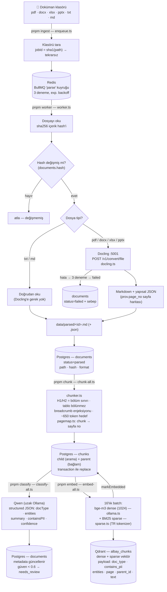
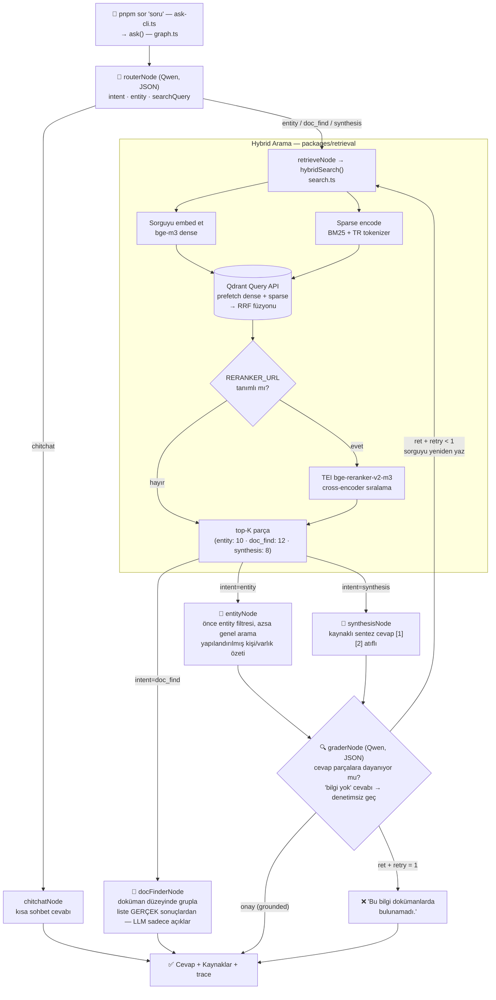

# Albay RAG

Albay Teknoloji'nin şirket içi (on-premise, air-gapped) **multi-agent RAG** tabanlı kurumsal arama ve soru-cevap sistemi. RAGFlow'dan tamamen özel bir TypeScript mimarisine geçiş projesi.

Kullanıcılar doğal dille soru sorar; sistem üç senaryoyu destekler:

1. **Varlık/kişi sorgusu** — "Altay Şimşek hakkında bilgi getir" → dokümanlardan toparlanmış yapılandırılmış özet
2. **Doküman bulma** — "Teknofest ile ilgili dosyaları bul" → gerçek dosya listesi (uydurma imkânsız)
3. **Bilgi sentezi** — "AI Committee onay süreci nasıl işliyor?" → kaynaklı, sentezlenmiş cevap

Her cevap kaynak atıflıdır; dayanak yoksa sistem **"Bu bilgi dokümanlarda bulunamadı"** der.

## Mimari ve Akışlar

### 1. Veri Akışı — dosyadan Qdrant + Postgres'e (indeksleme hattı)



### 2. Sorgu Akışı — kullanıcı sorusundan cevaba (LangGraph.js graph'ı)



## Stack

| Katman | Teknoloji |
|---|---|
| Dil / runtime | TypeScript, Node.js, pnpm workspaces |
| Agent orkestrasyon | LangGraph.js |
| LLM + embedding | Ollama (uzak): qwen2.5:14b-instruct + bge-m3 |
| Vector DB | Qdrant — hybrid: dense (cosine) + sparse (BM25, IDF server-side) |
| Reranker (opsiyonel) | TEI + bge-reranker-v2-m3 (x86; `--profile rerank`) |
| Parse | Docling (Docker sidecar) — layout-aware Markdown + sayfa haritası |
| Kuyruk | BullMQ + Redis |
| Metadata | PostgreSQL |

## Kurulum

```bash
# 1. Bagimliliklar
pnpm install

# 2. Ortam degiskenleri
cp .env.example .env
#    OLLAMA_BASE_URL'i uzak Ollama sunucuna gore duzenle

# 3. Yerel altyapi (Qdrant, Redis, Postgres, Docling)
docker compose up -d
#    x86 makinede reranker da isteniyorsa: docker compose --profile rerank up -d

# 4. Uzak Ollama sunucusunda modeller hazir olmali
#    ollama pull qwen2.5:14b-instruct && ollama pull bge-m3

# 5. Saglik kontrolu
pnpm smoke
```

## Kullanım

```bash
# Indeksleme hatti (sirayla)
pnpm migrate                    # DB semasi
pnpm ingest <klasor>            # dosyalari kuyruga ekle
pnpm worker                     # parse worker (ayri terminal, acik kalsin)
pnpm chunk                      # yapisal chunking
pnpm classify                   # LLM ile docType/entities/PII
pnpm embed                      # bge-m3 + Qdrant

# Sorgulama
pnpm sor "Albay Intelligence Hub süreci nasıl işliyor?" --trace
pnpm ara "Teknofest takımı"     # ham hybrid arama (agent'siz)

# Izleme / denetim
pnpm docs                       # dokuman listesi + chunk sayilari
pnpm ingest:status              # parse durumu
pnpm chunk:preview <dosya-adi>  # chunk kalite denetimi

# Kalite
pnpm test                       # birim testleri
pnpm eval -- --target agent     # golden set ile multi-agent olcumu
pnpm eval -- --target new       # duz RAG (karsilastirma)
pnpm eval -- --target ragflow   # RAGFlow baseline (API key gerekli)
```

## Repo Yapısı

```
packages/
├── shared/      # zod-dogrulamali config, ortak tipler
├── llm/         # Ollama client (chat/embed) + dokuman siniflandirici
├── chunking/    # yapisal chunker: H1-H2 sinirlari, tablo bolunmez,
│                #   breadcrumb, parent-child, sayfa eslemesi
├── retrieval/   # Qdrant hybrid arama (RRF), BM25 sparse encoder (TR), rerank
├── ingestion/   # Docling client, Postgres semasi/sorgulari
├── agents/      # LangGraph graph: router, entity/docfinder/synthesis, grader
└── eval/        # golden set, smoke test, eval harness (hedefler: agent/new/ragflow)
apps/
└── ingestion-worker/  # BullMQ worker + tum CLI'lar
docs/
└── parse-ve-chunking-rehberi.md
```

## Kalite Durumu (pilot korpus, 3 doküman / 62 chunk)

| Metrik | Hedef (PRD) | Ölçülen |
|---|---|---|
| Doğru kaynak oranı | ≥ %90 | **%100** |
| Tuzak başarısı (uydurmama) | ≥ %98 | **%100** |
| Retrieval süresi | ≤ 4 sn | ~0.3 sn |

## Yol Haritası

- [x] Faz 0 — Altyapı + eval iskeleti
- [x] Faz 1 — Parse pipeline (Docling + BullMQ)
- [x] Faz 2 — Yapısal chunking
- [x] Faz 3 — LLM sınıflandırma + embedding + Qdrant
- [x] Faz 4 — Hybrid retrieval (RRF) + reranker altyapısı
- [x] Faz 5 — LangGraph.js multi-agent orkestrasyon
- [ ] Faz 5b — Chat API (SSE) + web arayüzü + multi-turn hafıza
- [ ] Faz 6 — Auth/ACL/audit, RAGFlow karşılaştırması ve cutover

## Notlar

- `data/parsed/` korpusun düz metin kopyasını içerir — **yedekleme/senkron araçlarının dışında tutun** (KVKK).
- PII içeren dokümanlar aramada varsayılan olarak filtrelenir (`contains_pii` bayrağı); yetki katmanı Faz 6'da.
- Apple Silicon'da reranker çalışmaz (TEI arm64 imajı yok) — kod reranker'sız otomatik çalışır, production x86 kurulumunda etkinleştirilir.
